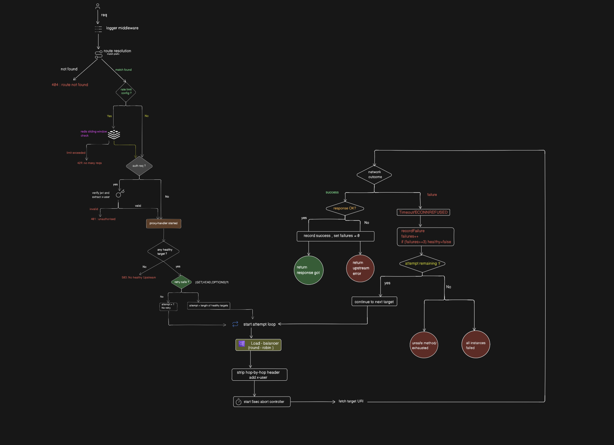

# REALGATEWAY

> A production-grade API Gateway built from scratch in TypeScript — featuring Circuit Breakers, JWT Auth, Redis-backed Rate Limiting, Round-Robin Load Balancing, Request ID Propagation, and Per-Route Observability.


                      ┌─────────────────┐
                      │     Client      │
                      └────────┬────────┘
                               │
                               ▼
                     ┌─────────────────────┐
                     │     API Gateway     │
                     └─────────┬───────────┘
                               │
        ┌──────────────────────┼──────────────────────┐
        │                      │                      │
        ▼                      ▼                      ▼
 ┌────────────┐       ┌──────────────┐       ┌──────────────┐
 │   Logger   │       │ Rate Limiter │       │ JWT Auth     │
 └─────┬──────┘       └──────┬───────┘       └──────┬───────┘
       │                     │                      │
       └─────────────────────┼──────────────────────┘
                             ▼
                 ┌─────────────────────┐
                 │   Load Balancer     │
                 │    Round Robin      │
                 └─────────┬───────────┘
                           ▼
                ┌──────────────────────┐
                │    Proxy Handler     │
                └─────────┬────────────┘
                          │
      ┌───────────────────┼───────────────────┐
      │                   │                   │
      ▼                   ▼                   ▼
┌──────────────┐   ┌──────────────┐   ┌──────────────┐
│ Service A    │   │ Service B    │   │ Service C    │
│ Instance #1  │   │ Instance #2  │   │ Instance #3  │
└──────────────┘   └──────────────┘   └──────────────┘
                          ▲
                          │
                 ┌───────────────────┐
                 │ Health Manager    │
                 │ Circuit Breaker   │
                 └───────────────────┘

---

## Request Lifecycle 


## What Is This?

REALGATEWAY is a custom-built API Gateway that sits in front of your microservices and handles all the cross-cutting concerns you'd otherwise have to implement in every single service:

| Concern | What REALGATEWAY Does |
|---|---|
| **Routing** | Matches request path prefix → forwards to correct service |
| **Load Balancing** | Round-Robin across multiple targets per route |
| **Circuit Breaker** | Automatically stops routing to failing targets (`CLOSED → OPEN → HALF_OPEN`) |
| **Auth** | Verifies JWT Bearer tokens before forwarding |
| **Rate Limiting** | Per-IP, per-route sliding window limits via Redis |
| **Retries** | Automatically retries safe methods (`GET`, `HEAD`, `OPTIONS`) on next healthy target |
| **Request Tracing** | `X-Request-Id` propagated to all downstream services |
| **Observability** | Global + per-route metrics exposed at `/gateway/metrics` |
| **Health Check** | Circuit state of all targets exposed at `/gateway/health` |

---

## Project Structure

```
src/
├── config/
│   ├── routes.ts            ← YOUR MAIN CONFIG FILE
│   └── other_Configs.ts     ← Thresholds, timeouts, cooldowns
├── loadbalancer/
│   ├── healthManager.ts     ← Circuit Breaker logic
│   └── roundRobin.ts        ← Load balancing algorithm
├── middleware/
│   ├── auth.ts              ← JWT verification
│   ├── logger.ts            ← Request logger with Request ID
│   ├── rateLimiter.ts       ← Redis sliding window rate limiter
│   └── requestId.ts         ← X-Request-Id propagation
├── proxy/
│   └── proxyHandler.ts      ← Core proxy with retry + circuit breaker
├── services/
│   └── gatewayService.ts    ← Express Router wiring all middleware
├── types/
│   ├── express.d.ts         ← Extended Express Request types
│   └── gateway.ts           ← RouteConfig, HealthState, CircuitState
└── utils/
    ├── ApiError.ts
    ├── asyncHandler.ts
    └── metrics.ts           ← Global + per-route counters
```

---

## Getting Started

### Prerequisites

- **Node.js** >= 18
- **Redis** running locally (or via Docker)
- **TypeScript** (dev dependency, already included)

### 1. Clone & Install

```bash
git clone https://github.com/Prashantbhati7/API-Gateway-mini.git
cd REALGATEWAY
npm install
```

### 2. Environment Variables

Create a `.env` file inside `src/`:

```env
PORT=3000
JWT_SECRET=your_super_secret_key_change_in_production
REDIS_URL=redis://localhost:6379
```

### 3. Configure Your Routes

Open **`src/config/routes.ts`** — this is the only file you need to edit to add or change routes.

```typescript
import type { RouteConfig } from '../types/gateway.js';

const routes: RouteConfig[] = [
  {
    prefix: '/orders',          // All requests starting with /orders go here
    auth: true,                 // true = require JWT Bearer token
    targets: [                  // List of upstream service instances
      'http://localhost:3001',
      'http://localhost:3002',
      'http://localhost:3003',
    ],
    ratelimit: {                // Optional: omit to disable rate limiting
      windowMs: 60 * 1000,     // 1 minute window
      max: 20,                 // max 20 requests per IP per window
      message: 'Too many requests to /orders, please try again later.',
    },
  },
  {
    prefix: '/auth',
    auth: false,                // false = no JWT required
    targets: [
      'http://localhost:5001',
      'http://localhost:5002',
    ],
    // ratelimit not set → no rate limiting on this route
  },
];

export default routes;
```

**RouteConfig fields:**

| Field | Type | Required | Description |
|---|---|---|---|
| `prefix` | `string` | ✅ | URL prefix to match (e.g. `/orders`) |
| `auth` | `boolean` | ✅ | Whether to enforce JWT auth |
| `targets` | `string[]` | ✅ | Upstream service base URLs |
| `ratelimit` | `object` | ❌ | Sliding window rate limit config |
| `ratelimit.windowMs` | `number` | ✅ | Window size in milliseconds |
| `ratelimit.max` | `number` | ✅ | Max requests per IP per window |
| `ratelimit.message` | `string` | ✅ | Error message when limit is hit |

### 4. Tune Gateway Behaviour

Edit **`src/config/other_Configs.ts`**:

```typescript
export const FAILURE_THRESHOLD = 3;      // failures before circuit trips OPEN
export const CIRCUIT_COOLDOWN_MS = 10000; // ms to wait before trying HALF_OPEN
export const PROXY_TIMEOUT_MS = 5000;    // ms before an upstream request times out
```

### 5. Run

```bash
# Development (hot reload)
npm run dev

# Production build
npm run build
npm start
```

---

## Docker

> **Note:** Docker image link will be added here.

### Using Docker Compose (recommended)

```yaml
# docker-compose.yml
version: '3.8'

services:
  gateway:
    image: prashantbhati7/realgateway:latest   # ← paste your image here
    ports:
      - "3000:3000"
    environment:
      PORT: 3000
      JWT_SECRET: your_super_secret_key_change_in_production
      REDIS_URL: redis://redis:6379
    depends_on:
      - redis

  redis:
    image: redis:7-alpine
    ports:
      - "6379:6379"
```

```bash
docker compose up
```

### Build Your Own Image

```dockerfile
# Dockerfile (place at project root)
FROM node:20-alpine AS builder
WORKDIR /app
COPY package*.json ./
RUN npm ci
COPY . .
RUN npm run build

FROM node:20-alpine
WORKDIR /app
COPY package*.json ./
RUN npm ci --only=production
COPY --from=builder /app/dist ./dist
COPY src/.env ./dist/.env
EXPOSE 3000
CMD ["node", "dist/server.js"]
```

```bash
docker build -t realgateway .
docker run -p 3000:3000 --env-file src/.env realgateway
```

---

## API Endpoints

### `GET /gateway/health`

Returns the Circuit Breaker state of every upstream target.

```json
{
  "status": "degraded",
  "routes": {
    "/orders": [
      { "url": "http://localhost:3001", "state": "CLOSED", "failures": 0, "lastFailureTime": null },
      { "url": "http://localhost:3002", "state": "OPEN",   "failures": 3, "lastFailureTime": 1718982000000 },
      { "url": "http://localhost:3003", "state": "HALF_OPEN", "failures": 3, "lastFailureTime": 1718982000000 }
    ]
  }
}
```

**Status values:**
- `ok` — all targets across all routes are `CLOSED`
- `degraded` — at least one target is `OPEN` or `HALF_OPEN`

### `GET /gateway/metrics`

Returns global counters and per-route breakdowns.

```json
{
  "global": {
    "totalRequests": 1000,
    "successfulRequests": 900,
    "failedRequests": 80,
    "retries": 15,
    "timeouts": 4,
    "rateLimitedRequests": 20
  },
  "routes": {
    "/orders": {
      "requests": 500,
      "successes": 450,
      "failures": 50,
      "retries": 10,
      "timeouts": 3,
      "rateLimited": 5
    },
    "/auth": {
      "requests": 300,
      "successes": 250,
      "failures": 30,
      "retries": 5,
      "timeouts": 1,
      "rateLimited": 15
    }
  }
}
```

---

## How the Circuit Breaker Works

```
           failures >= FAILURE_THRESHOLD
CLOSED ──────────────────────────────→ OPEN
  ↑                                      │
  │                                      │ wait CIRCUIT_COOLDOWN_MS
  │                                      ↓
success ←──────── HALF_OPEN ←────────────┘
                      │
                   failure
                      │
                      ↓
                    OPEN (again)
```

1. **CLOSED** — Normal operation. Requests flow through. Failures are counted.
2. **OPEN** — Threshold exceeded. Requests are immediately rejected with `503`. No network call made. Saves downstream systems from cascading load.
3. **HALF_OPEN** — After `CIRCUIT_COOLDOWN_MS`, the gateway allows real traffic through to test the target. A success closes the circuit; a failure re-opens it.

> The background cooldown manager runs every `CIRCUIT_COOLDOWN_MS` and promotes `OPEN` → `HALF_OPEN` when the timer passes.

---

## How Request ID Propagation Works

Every request gets a unique `X-Request-Id` header:
- If the client already sends one, it is **kept** (useful for end-to-end tracing from a frontend).
- If not, the gateway **generates** one using `crypto.randomUUID()`.

This ID is **forwarded to all downstream services** in the `x-request-id` header and logged on every gateway log line:

```
[550e8400-e29b-41d4-a716-446655440000] ─────────────────────────────────────
[550e8400-e29b-41d4-a716-446655440000] Timestamp : 2024-06-21T14:00:00.000Z
[550e8400-e29b-41d4-a716-446655440000] Method    : GET
[550e8400-e29b-41d4-a716-446655440000] URL       : /orders/123
[550e8400-e29b-41d4-a716-446655440000] Status    : 200
[550e8400-e29b-41d4-a716-446655440000] Latency   : 45 ms
```

Your downstream services should read `req.headers['x-request-id']` and include it in their own logs to get full distributed tracing.

---

## What Could Be Added Next

This gateway is production-capable as-is, but here are meaningful extensions that would take it further:

### Load Balancing Algorithms

Currently only **Round-Robin** is implemented. Other algorithms that could be added in `src/loadbalancer/`:

| Algorithm | When to Use |
|---|---|
| **Weighted Round-Robin** | When targets have different capacities (e.g. one server has 2x RAM) |
| **Least Connections** | Route to the target with fewest active requests — great for long-lived connections |
| **IP Hash / Sticky Sessions** | Always route the same client IP to the same target — needed for stateful services |
| **Random** | Simple, no state needed, surprisingly effective under uniform load |
| **Least Response Time** | Combines least connections with lowest latency — most sophisticated |

### Idempotency for Unsafe Route Retries

Currently, retries are only done for **safe HTTP methods** (`GET`, `HEAD`, `OPTIONS`) because `POST`, `PUT`, `PATCH`, `DELETE` could have side effects if retried blindly.

To safely retry unsafe methods, you'd add an **Idempotency Key** mechanism:

1. Client sends `Idempotency-Key: <uuid>` header with every `POST`/`PUT`.
2. Gateway checks Redis: has this key been seen before?
   - **No** → forward the request, store the response in Redis with a TTL.
   - **Yes** → return the cached response immediately — no duplicate side effect.
3. This makes unsafe routes safe to retry on timeout.

### Other Extensions

- **Response Caching** — Cache `GET` responses in Redis by URL + headers, with configurable TTL per route
- **Request/Response Transformation** — Rewrite headers, paths, or payloads before forwarding (e.g. strip `/api/v1` prefix)
- **gRPC Proxying** — Extend the proxy to support gRPC upstreams, not just HTTP
- **mTLS / Service Mesh** — Mutual TLS between gateway and upstreams for zero-trust networking
- **Dynamic Route Reloading** — Hot-reload `routes.ts` via admin API without restarting the gateway
- **WebSocket Support** — Upgrade HTTP connections and proxy WebSocket traffic
- **Distributed Rate Limiting** — The Redis rate limiter already works distributed; add shared quota across routes (e.g. one global limit per user across all services)
- **OpenTelemetry** — Export traces and spans to Jaeger, Zipkin, or Grafana Tempo for full distributed tracing dashboards

---

## Tech Stack

| Layer | Technology |
|---|---|
| Runtime | Node.js 20 + TypeScript |
| HTTP Framework | Express 5 |
| Rate Limiting Store | Redis (via ioredis) |
| Auth | JWT (jsonwebtoken) |
| Load Balancer | Custom Round-Robin |
| Circuit Breaker | Custom (CLOSED / OPEN / HALF_OPEN) |
| Request Tracing | `crypto.randomUUID()` + `X-Request-Id` |

---

## Author

**Prashant Bhati**